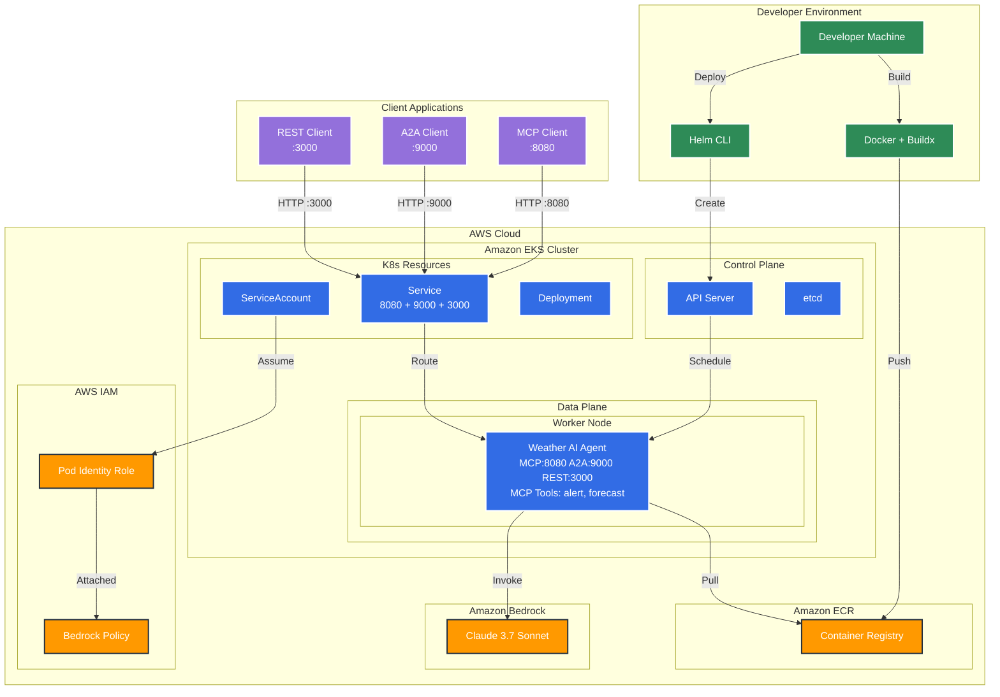

# AI Agents on EKS

A generic AI agent framework built with Strands Agents, MCP (Model Context Protocol), A2A (Agent to Agent), and REST API. Configurable for any domain including weather forecasts, financial analysis, customer service, and more.


## Deploy your first AI Agent on EKS

This tutorial will guide you through deploying the Generic AI Agent Framework to Amazon EKS (Elastic Kubernetes Service) with multi-architecture support and Amazon Bedrock integration. The framework includes a Weather Assistant as a reference implementation.

### Table of Contents

1. [Prerequisites](#prerequisites)
2. [Environment Setup](#environment-setup)
3. [Agent Configuration](#agent-configuration)
4. [Create EKS Cluster](#create-eks-cluster)
5. [Configure IAM and Bedrock Access](#configure-iam-and-bedrock-access)
6. [Container Registry Setup](#container-registry-setup)
7. [Build and Push Multi-Architecture Image](#build-and-push-multi-architecture-image)
8. [Deploy to Kubernetes](#deploy-to-kubernetes)
9. [Verify Deployment](#verify-deployment)
10. [Access the Weather Agent](#access-the-weather-agent)
11. [Clean Up Resources](#clean-up-resources)

---

### Architecture Overview

The following diagram shows the complete architecture of the Weather Agent deployment on Amazon EKS:



**Key Components:**

- **Triple Protocol Support**: Single pod serves MCP (port 8080), A2A (port 9000), and REST API (port 3000) protocols
- **EKS Auto Mode**: Automatic node provisioning and management
- **Pod Identity**: Secure access to Amazon Bedrock without storing credentials
- **MCP Protocol**: Standardized interface for AI model communication via HTTP
- **A2A Protocol**: Agent-to-Agent communication for multi-agent workflows
- **REST API**: Traditional HTTP REST endpoints for weather queries
- **Container Registry**: Stores the weather agent container image

---

### Prerequisites

Before starting this tutorial, ensure you have the following tools installed:

- [AWS CLI](https://aws.amazon.com/cli/) (v2.0 or later)
- [eksctl](https://eksctl.io/) (v0.180.0 or later)
- [kubectl](https://kubernetes.io/docs/tasks/tools/) (v1.28 or later)
- [Docker](https://docs.docker.com/get-docker/) with buildx support
- [Helm](https://helm.sh/docs/intro/install/) (v3.0 or later)

**Required AWS Permissions:**
- EKS cluster creation and management
- IAM role and policy management
- ECR repository management
- Amazon Bedrock access

---

### Environment Setup

Set up the required environment variables for the deployment:

```bash
# AWS Configuration
export AWS_ACCOUNT_ID=$(aws sts get-caller-identity --query 'Account' --output text)
export AWS_REGION=us-west-2

# EKS Cluster Configuration
export CLUSTER_NAME=agentic-ai-on-eks

# Kubernetes Configuration
export KUBERNETES_APP_WEATHER_AGENT_NAMESPACE=weather-agent
export KUBERNETES_APP_WEATHER_AGENT_NAME=weather-agent
export KUBERNETES_APP_WEATHER_AGENT_SERVICE_ACCOUNT=weather-agent

# ECR Configuration
export ECR_REPO_NAME=agents-on-eks/weather-agent
export ECR_REPO_HOST=${AWS_ACCOUNT_ID}.dkr.ecr.${AWS_REGION}.amazonaws.com
export ECR_REPO_WEATHER_AGENT_URI=${ECR_REPO_HOST}/${ECR_REPO_NAME}

# Amazon Bedrock Configuration
export BEDROCK_MODEL_ID=us.anthropic.claude-3-7-sonnet-20250219-v1:0
export BEDROCK_PODIDENTITY_IAM_ROLE=${CLUSTER_NAME}-bedrock-role

# Agent Configuration (Optional)
# export AGENT_CONFIG_FILE=/path/to/custom/agent.md  # Override default agent.md
```

> **Note:** Make sure you have access to the Amazon Bedrock model `us.anthropic.claude-3-7-sonnet-20250219-v1:0` in your AWS account. You can change the model by updating the `BEDROCK_MODEL_ID` variable.

---

### Agent Configuration

The weather agent's behavior is defined in the `agent.md` file, which contains:
- **Agent Name**: Display name for the agent
- **Agent Description**: Brief description of the agent's capabilities
- **System Prompt**: Instructions that define the agent's behavior and expertise

#### Default Configuration

The default `agent.md` file configures a standard weather assistant:

```markdown
# Weather Assistant Agent Configuration

## Agent Name
Weather Assistant

## Agent Description
Weather Assistant that provides weather forecasts and alerts

## System Prompt
You are Weather Assistant that helps the user with forecasts or alerts:
- Provide weather forecasts for US cities for the next 3 days if no specific period is mentioned
- When returning forecasts, always include whether the weather is good for outdoor activities for each day
- Provide information about weather alerts for US cities when requested
```

#### Custom Agent Configuration

You can customize the agent by:

1. **Modifying the default `agent.md` file** directly, or
2. **Creating a custom configuration file** and setting the `AGENT_CONFIG_FILE` environment variable:

```bash
# Create custom agent configuration
cat > custom_weather_agent.md << 'EOF'
# Advanced Weather Specialist Configuration

## Agent Name
Advanced Weather Specialist

## Agent Description
Advanced Weather Specialist providing detailed meteorological analysis

## System Prompt
You are an Advanced Weather Specialist with expertise in meteorology:
- Provide comprehensive weather forecasts for any location worldwide
- Include detailed meteorological analysis with pressure systems and wind patterns
- Offer specialized advice for aviation, marine, and agricultural weather needs
- Always explain the reasoning behind your forecasts using meteorological principles
EOF

# Use custom configuration
export AGENT_CONFIG_FILE=/path/to/custom_weather_agent.md
```

#### Configuration Loading

The agent configuration is loaded at runtime with the following priority:
1. **Custom file** specified by `AGENT_CONFIG_FILE` environment variable
2. **Default file** `agent.md` in the project directory
3. **Fallback file** `cloudbot.md` if `agent.md` is missing (featuring CloudBot - a cheerful AI agent perfect for workshop demos! 🌟)

**Important**: An MD configuration file is **required**. The system will raise an error if no configuration file is found.

---

### Create EKS Cluster

Create an EKS cluster with auto mode enabled for simplified management:

```bash
eksctl create cluster --name ${CLUSTER_NAME} --enable-auto-mode
```

This command will:
- Create a new EKS cluster with Kubernetes v1.32
- Enable EKS auto mode for automatic node provisioning
- Set up both AMD64 and ARM64 node support
- Configure the necessary VPC and networking
- Install essential add-ons like metrics-server

**Expected output:**
```
✔ EKS cluster "agents-on-eks" in "us-west-2" region is ready
```

Verify the cluster is running:
```bash
kubectl get pods -A
```

---

### Configure IAM and Bedrock Access

#### Step 1: Create IAM Role for Pod Identity

Create an IAM role that allows EKS pods to access Amazon Bedrock:

```bash
aws iam create-role \
  --role-name ${BEDROCK_PODIDENTITY_IAM_ROLE} \
  --assume-role-policy-document '{
    "Version": "2012-10-17",
    "Statement": [
      {
        "Effect": "Allow",
        "Principal": {
          "Service": "pods.eks.amazonaws.com"
        },
        "Action": [
          "sts:AssumeRole",
          "sts:TagSession"
        ]
      }
    ]
  }'
```

#### Step 2: Attach Bedrock Access Policy

Add the necessary permissions for Amazon Bedrock:

```bash
aws iam put-role-policy \
  --role-name ${BEDROCK_PODIDENTITY_IAM_ROLE} \
  --policy-name BedrockAccess \
  --policy-document '{
    "Version": "2012-10-17",
    "Statement": [
      {
        "Effect": "Allow",
        "Action": [
          "bedrock:InvokeModel",
          "bedrock:InvokeModelWithResponseStream"
        ],
        "Resource": "*"
      }
    ]
  }'
```

#### Step 3: Create Pod Identity Association

Link the IAM role to your Kubernetes service account:

```bash
aws eks create-pod-identity-association \
  --cluster ${CLUSTER_NAME} \
  --role-arn arn:aws:iam::${AWS_ACCOUNT_ID}:role/${BEDROCK_PODIDENTITY_IAM_ROLE} \
  --namespace ${KUBERNETES_APP_WEATHER_AGENT_NAMESPACE} \
  --service-account ${KUBERNETES_APP_WEATHER_AGENT_SERVICE_ACCOUNT}
```

---

### Container Registry Setup

#### Step 1: Create ECR Repository

Create a private ECR repository for the weather agent image:

```bash
aws ecr create-repository --repository-name ${ECR_REPO_NAME}
```

#### Step 2: Authenticate Docker with ECR

Log in to your ECR registry:

```bash
aws ecr get-login-password --region ${AWS_REGION} | \
  docker login --username AWS --password-stdin ${ECR_REPO_HOST}
```

---

### Build and Push Multi-Architecture Image

#### Step 1: Set up Docker Buildx

Create and configure a multi-architecture builder:

```bash
docker buildx create --name multiarch --use
docker buildx use multiarch
```

#### Step 2: Build and Push Multi-Architecture Image

Build the image for both AMD64 and ARM64 architectures:

```bash
docker buildx build \
  --platform linux/amd64,linux/arm64 \
  -t ${ECR_REPO_WEATHER_AGENT_URI}:latest \
  --push .
```

This command will:
- Build the image for both x86_64 and ARM64 architectures
- Create a multi-architecture manifest
- Push the image directly to ECR

#### Step 3: Verify Multi-Architecture Support

Confirm the image supports both architectures:

```bash
docker manifest inspect ${ECR_REPO_WEATHER_AGENT_URI}:latest | grep -E "(amd64|arm64)"
```

You should see entries for both `linux/amd64` and `linux/arm64`.

---

### Deploy to Kubernetes

Deploy the weather agent using Helm:

```bash
helm upgrade ${KUBERNETES_APP_WEATHER_AGENT_NAME} helm --install \
  --namespace ${KUBERNETES_APP_WEATHER_AGENT_NAMESPACE} --create-namespace \
  --set serviceAccount.name=${KUBERNETES_APP_WEATHER_AGENT_SERVICE_ACCOUNT} \
  --set image.repository=${ECR_REPO_WEATHER_AGENT_URI} \
  --set image.pullPolicy=Always \
  --set image.tag=latest
```

This will:
- Create the necessary Kubernetes resources
- Deploy the weather agent with the correct service account
- Expose the weathaer agent service in ports 8080(mcp), 9000(a2a), and 3000(rest)

---

### Verify Deployment

#### Step 1: Check Pod Status

Verify the pod is running successfully:

```bash
kubectl -n ${KUBERNETES_APP_WEATHER_AGENT_NAMESPACE} \
   rollout restart deployment/${KUBERNETES_APP_WEATHER_AGENT_NAME}
kubectl -n ${KUBERNETES_APP_WEATHER_AGENT_NAMESPACE} \
   rollout status deployment/${KUBERNETES_APP_WEATHER_AGENT_NAME}
kubectl -n ${KUBERNETES_APP_WEATHER_AGENT_NAMESPACE} \
  get pods -l app.kubernetes.io/instance=${KUBERNETES_APP_WEATHER_AGENT_NAME}
```
> **Note:** Takes 3 minutes to provision a new node

Expected output:
```
Waiting for deployment "weather-agent" rollout to finish: 0 of 1 updated replicas are available...
NAME                            READY   STATUS    RESTARTS   AGE
weather-agent-xxxxxxxxx-xxxxx   1/1     Running   0          2m
```

#### Step 2: Check Application Logs

View the weather agent logs:

```bash
kubectl -n ${KUBERNETES_APP_WEATHER_AGENT_NAMESPACE} \
  logs deployment/${KUBERNETES_APP_WEATHER_AGENT_NAME}
```

You should see:
```
INFO - Starting Weather Agent Triple Server...
INFO - MCP Server will run on port 8080 with streamable-http
INFO - A2A Server will run on port 9000
INFO - REST API Server will run on port 3000
INFO - Starting MCP Server
INFO - Starting A2A Server
INFO - Starting REST API Server
INFO - All three servers started successfully!
```

#### Step 3: Verify Service

Check that the service endpoints for MCP(8080), A2A(9000) and REST(3000) is created:

```bash
kubectl -n ${KUBERNETES_APP_WEATHER_AGENT_NAMESPACE} \
  get ep ${KUBERNETES_APP_WEATHER_AGENT_NAME}
```

---

### Access the Weather Agent

The weather agent supports three protocols simultaneously. You can access it through port forwarding for development or test it using the provided test clients.


#### Run Port forward to expose the agent locally
```bash
# Port forward all three services
kubectl -n ${KUBERNETES_APP_WEATHER_AGENT_NAMESPACE} \
  port-forward service/${KUBERNETES_APP_WEATHER_AGENT_NAME} 8080:mcp 9000:a2a 3000:rest
```

#### Test the Agent with curl:
```bash
# Chat with weather agent
./test_e2e_rest_api_curl.sh
```
The expected output:
```
...
═══════════════════════════════════════════════════════════════════════════════
🌤️  Workshop Test Summary
═══════════════════════════════════════════════════════════════════════════════

🎉 Weather Agent API testing completed!
📊 Test Results:
   • Health Check: Passed ✅
   • Weather Forecasts: 5 queries tested 🌤️
   • API Endpoints: REST API (port 3000) 🔗

🔧 Additional Testing Options:
   • MCP Protocol: Use test_e2e_mcp.py (port 8080)
   • A2A Protocol: Use test_e2e_a2a.py (port 9000)
   • REST API:     Use test_e2e_rest_api.py   (port 3000)

✨ Workshop participants can now interact with the Weather Agent! ✨
...
```


#### Automated Testing

**Test All Protocols:**
```bash
# In separate terminals, run each test client:
uv run test_e2e_mcp.py        # Tests MCP Protocol (6 tests)
uv run test_e2e_a2a.py        # Tests A2A Protocol (6 tests)
uv run test_e2e_rest_api.py   # Tests REST API (9 tests)
```

#### Test Client Features

Each test client provides:
- **Server Readiness Check**: Automatically waits for server availability
- **Comprehensive Testing**: Covers all major protocol functionality
- **Professional Output**: Clean, numbered tests with ✅/❌ indicators
- **Error Handling**: Graceful failure handling with clear messages
- **Response Preview**: Shows truncated responses for verification

#### Expected Test Results

**MCP Protocol (6 tests):**
- HTTP connectivity and SSE validation
- Session initialization and protocol negotiation
- Tool discovery with parameter enumeration
- Weather forecast and alert tool execution
- Complex multi-city weather comparisons

**A2A Protocol (6 tests):**
- Agent card discovery and capabilities
- Client initialization and connection
- Weather forecast and alert queries
- Response validation and formatting

**REST API (9 tests):**
- Health check endpoint validation
- Chat endpoint functionality with session management
- Session continuity and context awareness
- Conversation history management
- Session information retrieval
- History clearing functionality
- Error handling (404, 400 responses)

---

### Clean Up Resources

When you're done with the tutorial, clean up the resources to avoid charges:

#### Step 1: Uninstall the Application

```bash
helm uninstall ${KUBERNETES_APP_WEATHER_AGENT_NAME} \
  --namespace ${KUBERNETES_APP_WEATHER_AGENT_NAMESPACE}
```

#### Step 2: Delete ECR Repository

```bash
aws ecr delete-repository --repository-name ${ECR_REPO_NAME} --force
```

#### Step 3: Delete IAM Role and Policies

```bash
# Delete the inline policy
aws iam delete-role-policy \
  --role-name ${BEDROCK_PODIDENTITY_IAM_ROLE} \
  --policy-name BedrockAccess

# Delete the IAM role
aws iam delete-role --role-name ${BEDROCK_PODIDENTITY_IAM_ROLE}
```

#### Step 4: Delete EKS Cluster

```bash
eksctl delete cluster --name ${CLUSTER_NAME}
```


---

## CONTRIBUTING

#### Prerequisites

Ensure you have the following configured
```bash
export AWS_ACCESS_KEY_ID=<key here>
export AWS_SECRET_ACCESS_KEY=<access key here>
export AWS_SESSION_TOKEN=<session here>
```

#### Install dependencies
```bash
uv sync
```

#### Run interactive mode
```bash
uv run interactive
```

#### Run as mcp server streamable-http or stdio
```bash
uv run mcp-server --transport streamable-http
```

#### Run the mcp client
```bash
uv run test_e2e_mcp.py
```

Connect your mcp client such as `npx @modelcontextprotocol/inspector` then in the UI use streamable-http with `http://localhost:8080/mcp`

#### Run as a2a server
```bash
uv run a2a-server
```

#### Run the a2a client
```bash
uv run test_e2e_a2a.py
```

#### Run as REST API server
```bash
uv run rest-api
```

#### Run the REST API client
```bash
uv run test_e2e_rest_api.py
```

#### Running in a Container

Build the container using docker
```bash
docker build . --tag agent
```
Build the container using finch
```bash
finch build . --tag agent
```

Run the agent interactive
```bash
docker run -it \
-v $HOME/.aws:/app/.aws \
-e AWS_REGION=${AWS_REGION} \
-e AWS_ACCESS_KEY_ID=${AWS_ACCESS_KEY_ID} \
-e AWS_SECRET_ACCESS_KEY=${AWS_SECRET_ACCESS_KEY} \
-e AWS_SESSION_TOKEN=${AWS_SESSION_TOKEN} \
agent interactive
```
Type a question, to exit use `/quit`


Run the agent as multi-server mcp, a2a, and REST API
```bash
docker run \
-v $HOME/.aws:/app/.aws \
-p 8080:8080 \
-p 9000:9000 \
-p 3000:3000 \
-e AWS_REGION=${AWS_REGION} \
-e AWS_ACCESS_KEY_ID=${AWS_ACCESS_KEY_ID} \
-e AWS_SECRET_ACCESS_KEY=${AWS_SECRET_ACCESS_KEY} \
-e AWS_SESSION_TOKEN=${AWS_SESSION_TOKEN} \
-e DEBUG=1 \
agent agent
```

Use test clients to verify all three protocols:
```bash
uv run test_e2e_mcp.py        # Tests MCP Protocol
uv run test_e2e_a2a.py        # Tests A2A Protocol
uv run test_e2e_rest_api.py   # Tests REST API
```

Now you can connect with the MCP client to `http://localhost:8080/mcp`.

Use the MCP Inspector to test the connection:

```bash
npx @modelcontextprotocol/inspector
```

In the UI, use:
- **Transport:** streamable-http
- **URL:** http://localhost:8080/mcp
