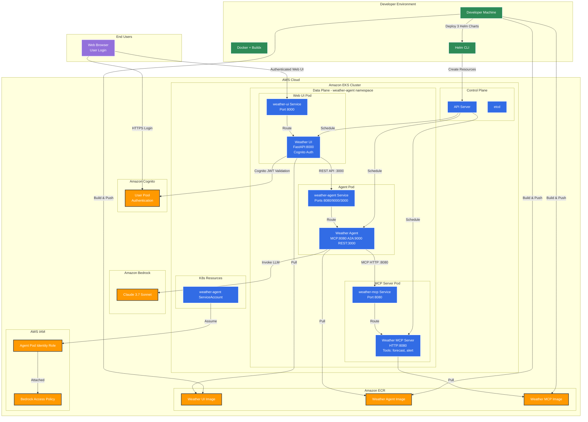

# AI Agents on EKS

A generic AI agent framework built with Strands Agents, MCP (Model Context Protocol), A2A (Agent to Agent), and FastAPI. Configurable for any domain including weather forecasts, financial analysis, customer service, and more.


## Deploy your first AI Agent on EKS

This tutorial will guide you through deploying the Generic AI Agent Framework to Amazon EKS (Elastic Kubernetes Service) with multi-architecture support and Amazon Bedrock integration. The framework includes a Weather Assistant as a reference implementation.

### Table of Contents

1. [Prerequisites](#prerequisites)
2. [Environment Setup](#environment-setup)
3. [Agent Configuration](#agent-configuration)
4. [Create EKS Cluster](#create-eks-cluster)
5. [Configure IAM and Bedrock Access](#configure-iam-and-bedrock-access)
6. [Container Registry Setup](#container-registry-setup)
7. [Build and Push Multi-Architecture Image](#build-and-push-multi-architecture-image)
8. [Deploy to Kubernetes](#deploy-to-kubernetes)
9. [Verify Deployment](#verify-deployment)
10. [Access the Weather Agent](#access-the-weather-agent)
11. [Clean Up Resources](#clean-up-resources)

---

### Architecture Overview

The following diagram shows the complete architecture of the Weather Agent deployment on Amazon EKS:



**Key Components:**

- **Three-Service Architecture**: Separate deployments for Web UI (port 8000), Agent Service (ports 8080/9000/3000), and MCP Server (port 8080)
- **Web UI with Authentication**: FastAPI-based frontend with Amazon Cognito integration for user authentication
- **Agent Service**: Triple protocol support serving MCP (port 8080), A2A (port 9000), and REST API (port 3000)
- **MCP Server**: Dedicated weather tools server providing forecast and alert capabilities via HTTP
- **EKS Auto Mode**: Automatic node provisioning and management
- **Pod Identity**: Secure access to Amazon Bedrock without storing credentials
- **Three Helm Charts**: Separate deployments from `helm/`, `web/helm/`, and `mcp-servers/weather-mcp-server/helm/`
- **Container Registry**: Stores three separate container images for each service

---

### Prerequisites

Before starting this tutorial, ensure you have the following tools installed:

- [AWS CLI](https://aws.amazon.com/cli/) (v2.0 or later)
- [eksctl](https://eksctl.io/) (v0.180.0 or later)
- [kubectl](https://kubernetes.io/docs/tasks/tools/) (v1.28 or later)
- [Docker](https://docs.docker.com/get-docker/) with buildx support
- [Helm](https://helm.sh/docs/intro/install/) (v3.0 or later)

**Required AWS Permissions:**
- EKS cluster creation and management
- IAM role and policy management
- ECR repository management
- Amazon Bedrock access

---

### Environment Setup

Set up the required environment variables for the deployment:

```bash
# AWS Configuration
export AWS_ACCOUNT_ID=$(aws sts get-caller-identity --query 'Account' --output text)
export AWS_REGION=us-west-2

# EKS Cluster Configuration
export CLUSTER_NAME=agentic-ai-on-eks

# Kubernetes Configuration
export KUBERNETES_APP_WEATHER_MCP_NAMESPACE=weather-agent
export KUBERNETES_APP_WEATHER_MCP_NAME=weather-mcp

export KUBERNETES_APP_WEATHER_AGENT_NAMESPACE=weather-agent
export KUBERNETES_APP_WEATHER_AGENT_NAME=weather-agent
export KUBERNETES_APP_WEATHER_AGENT_SERVICE_ACCOUNT=weather-agent

export KUBERNETES_APP_WEATHER_AGENT_UI_NAMESPACE=weather-agent
export KUBERNETES_APP_WEATHER_AGENT_UI_NAME=weather-ui
export KUBERNETES_APP_WEATHER_AGENT_UI_SERVICE_ACCOUNT=weather-ui


# ECR Configuration
export ECR_REPO_HOST=${AWS_ACCOUNT_ID}.dkr.ecr.${AWS_REGION}.amazonaws.com

export ECR_REPO_MCP_NAME=agents-on-eks/weather-mcp
export ECR_REPO_WEATHER_MCP_URI=${ECR_REPO_HOST}/${ECR_REPO_MCP_NAME}

export ECR_REPO_NAME=agents-on-eks/weather-agent
export ECR_REPO_WEATHER_AGENT_URI=${ECR_REPO_HOST}/${ECR_REPO_NAME}

export ECR_REPO_UI_NAME=agents-on-eks/weather-agent-ui
export ECR_REPO_WEATHER_AGENT_UI_URI=${ECR_REPO_HOST}/${ECR_REPO_UI_NAME}

# Amazon Bedrock Configuration
export BEDROCK_MODEL_ID=us.anthropic.claude-3-7-sonnet-20250219-v1:0
export BEDROCK_PODIDENTITY_IAM_ROLE=${CLUSTER_NAME}-bedrock-role


# Agent Configuration (Optional)
# export AGENT_CONFIG_FILE=/path/to/custom/agent.md  # Override default agent.md
```

> **Note:** Make sure you have access to the Amazon Bedrock model `us.anthropic.claude-3-7-sonnet-20250219-v1:0` in your AWS account. You can change the model by updating the `BEDROCK_MODEL_ID` variable.

---

### Agent Configuration

The weather agent's behavior is defined in the `agent.md` file, which contains:
- **Agent Name**: Display name for the agent
- **Agent Description**: Brief description of the agent's capabilities
- **System Prompt**: Instructions that define the agent's behavior and expertise

#### Default Configuration

The default `agent.md` file configures a standard weather assistant:

```markdown
# Weather Assistant Agent Configuration

## Agent Name
Weather Assistant

## Agent Description
Weather Assistant that provides weather forecasts and alerts

## System Prompt
You are Weather Assistant that helps the user with forecasts or alerts:
- Provide weather forecasts for US cities for the next 3 days if no specific period is mentioned
- When returning forecasts, always include whether the weather is good for outdoor activities for each day
- Provide information about weather alerts for US cities when requested
```

#### Custom Agent Configuration

You can customize the agent by:

1. **Modifying the default `agent.md` file** directly, or
2. **Creating a custom configuration file** and setting the `AGENT_CONFIG_FILE` environment variable:

```bash
# Create custom agent configuration
cat > custom_weather_agent.md << 'EOF'
# Advanced Weather Specialist Configuration

## Agent Name
Advanced Weather Specialist

## Agent Description
Advanced Weather Specialist providing detailed meteorological analysis

## System Prompt
You are an Advanced Weather Specialist with expertise in meteorology:
- Provide comprehensive weather forecasts for any location worldwide
- Include detailed meteorological analysis with pressure systems and wind patterns
- Offer specialized advice for aviation, marine, and agricultural weather needs
- Always explain the reasoning behind your forecasts using meteorological principles
EOF

# Use custom configuration
export AGENT_CONFIG_FILE=/path/to/custom_weather_agent.md
```

#### Configuration Loading

The agent configuration is loaded at runtime with the following priority:
1. **Custom file** specified by `AGENT_CONFIG_FILE` environment variable
2. **Default file** `agent.md` in the project directory
3. **Fallback file** `cloudbot.md` if `agent.md` is missing (featuring CloudBot - a cheerful AI agent perfect for workshop demos! 🌟)

**Important**: An MD configuration file is **required**. The system will raise an error if no configuration file is found.

---

### Create EKS Cluster and related Infrastructure

Run the terraform

```bash
cd ../terraform
terraform apply
./prep-env-weather-agent.sh
./prep-env-weather-web.sh
cd -
```

---

### Container Registry Setup

#### Step 1: Create ECR Repositories

Create a private ECR repository for the weather mcp image:

```bash
aws ecr create-repository --repository-name ${ECR_REPO_MCP_NAME}
```

Create a private ECR repository for the weather agent image:

```bash
aws ecr create-repository --repository-name ${ECR_REPO_NAME}
```

#### Step 2: Authenticate Docker with ECR

Log in to your ECR registry:

```bash
aws ecr get-login-password --region ${AWS_REGION} | \
  docker login --username AWS --password-stdin ${ECR_REPO_HOST}
```

---

### Build and Push Multi-Architecture Image

#### Step 1: Set up Docker Buildx

Create and configure a multi-architecture builder:

```bash
docker buildx create --name multiarch --use
docker buildx use multiarch
```

#### Step 2: Build and Push Multi-Architecture Image

Build the image for both AMD64 and ARM64 architectures:

MCP Server:
```bash
docker buildx build \
  --platform linux/amd64,linux/arm64 \
  -t ${ECR_REPO_WEATHER_MCP_URI}:latest \
  --push mcp-servers/weather-mcp-server
```

```bash
cat > mcp.json << 'EOF'
{
  "mcpServers": {
    "weather-mcp-http": {
      "disabled": false,
      "timeout": 60000,
      "url": "http://weather-mcp:8080/mcp"
    }
  }
}
EOF
```


Agent:
```bash
docker buildx build \
  --platform linux/amd64,linux/arm64 \
  -t ${ECR_REPO_WEATHER_AGENT_URI}:latest \
  --push .
```

This command will:
- Build the image for both x86_64 and ARM64 architectures
- Create a multi-architecture manifest
- Push the image directly to ECR

#### Step 3: Verify Multi-Architecture Support

Confirm the image supports both architectures:

```bash
docker manifest inspect ${ECR_REPO_WEATHER_AGENT_URI}:latest | grep -E "(amd64|arm64)"
```

You should see entries for both `linux/amd64` and `linux/arm64`.

---

### Deploy to Kubernetes

Deploy the MCP Servers first:
```bash
helm upgrade ${KUBERNETES_APP_WEATHER_MCP_NAME} mcp-servers/weather-mcp-server/helm --install \
  --namespace ${KUBERNETES_APP_WEATHER_MCP_NAMESPACE} --create-namespace \
  --set image.repository=${ECR_REPO_WEATHER_MCP_URI} \
  --set image.pullPolicy=Always \
  --set image.tag=latest
```

Load the extra environment variables for the Agent:
```bash
source .env
```

Deploy the weather agent using Helm:
```bash
helm upgrade ${KUBERNETES_APP_WEATHER_AGENT_NAME} helm --install \
  --namespace ${KUBERNETES_APP_WEATHER_AGENT_NAMESPACE} --create-namespace \
  --set serviceAccount.name=${KUBERNETES_APP_WEATHER_AGENT_SERVICE_ACCOUNT} \
  --set image.repository=${ECR_REPO_WEATHER_AGENT_URI} \
  --set image.pullPolicy=Always \
  --set env.BEDROCK_MODEL_ID=${BEDROCK_MODEL_ID} \
  --set env.DYNAMODB_AGENT_STATE_TABLE_NAME=${DYNAMODB_AGENT_STATE_TABLE_NAME} \
  --set env.COGNITO_JWKS_URL=${COGNITO_JWKS_URL} \
  --set image.tag=latest
```

This will:
- Create the necessary Kubernetes resources
- Deploy the weather agent with the correct service account
- Expose the weathaer agent service in ports 8080(mcp), 9000(a2a), and 3000(rest)

---

### Verify Deployment

#### Step 1: Check Pod Status

Verify the pod is running successfully:

```bash
kubectl -n ${KUBERNETES_APP_WEATHER_AGENT_NAMESPACE} \
   rollout restart deployment/${KUBERNETES_APP_WEATHER_AGENT_NAME}
kubectl -n ${KUBERNETES_APP_WEATHER_AGENT_NAMESPACE} \
   rollout status deployment/${KUBERNETES_APP_WEATHER_AGENT_NAME}
kubectl -n ${KUBERNETES_APP_WEATHER_AGENT_NAMESPACE} \
  get pods -l app.kubernetes.io/instance=${KUBERNETES_APP_WEATHER_AGENT_NAME}
```
> **Note:** Takes 3 minutes to provision a new node

Expected output:
```
Waiting for deployment "weather-agent" rollout to finish: 0 of 1 updated replicas are available...
NAME                            READY   STATUS    RESTARTS   AGE
weather-agent-xxxxxxxxx-xxxxx   1/1     Running   0          2m
```

#### Step 2: Check Application Logs

View the weather agent logs:

```bash
kubectl -n ${KUBERNETES_APP_WEATHER_AGENT_NAMESPACE} \
  logs deployment/${KUBERNETES_APP_WEATHER_AGENT_NAME}
```

You should see:
```
INFO - Starting Weather Agent Triple Server...
INFO - MCP Server will run on port 8080 with streamable-http
INFO - A2A Server will run on port 9000
INFO - FastAPI Server will run on port 3000
INFO - Starting MCP Server
INFO - Starting A2A Server
INFO - Starting FastAPI Server
INFO - All three servers started successfully!
```

#### Step 3: Verify Service

Check that the service endpoints for MCP(8080), A2A(9000) and REST(3000) is created:

```bash
kubectl -n ${KUBERNETES_APP_WEATHER_AGENT_NAMESPACE} \
  get ep ${KUBERNETES_APP_WEATHER_AGENT_NAME}
```

---

### Access the Weather Agent

The weather agent supports three protocols simultaneously. You can access it through port forwarding for development or test it using the provided test clients.


#### Deploy the Weather Web Chat UI

Create a private ECR repository for the weather agent image:

```bash
aws ecr create-repository --repository-name ${ECR_REPO_UI_NAME}
```

Build the image for both AMD64 and ARM64 architectures:

```bash
docker buildx build \
  --platform linux/amd64,linux/arm64 \
  -t ${ECR_REPO_WEATHER_AGENT_UI_URI}:latest \
  --push web
```

Load the extra environment variables to be used in Helm:
```bash
source web/.env
```

Deploy the weather agent using Helm:
```bash
helm upgrade ${KUBERNETES_APP_WEATHER_AGENT_UI_NAME} web/helm --install \
  --namespace ${KUBERNETES_APP_WEATHER_AGENT_UI_NAMESPACE} --create-namespace \
  --set image.repository=${ECR_REPO_WEATHER_AGENT_UI_URI} \
  --set image.pullPolicy=Always \
  --set env.COGNITO_CLIENT_ID=${COGNITO_CLIENT_ID} \
  --set env.COGNITO_CLIENT_SECRET=${COGNITO_CLIENT_SECRET} \
  --set env.COGNITO_SIGNIN_URL=${COGNITO_SIGNIN_URL} \
  --set env.COGNITO_LOGOUT_URL=${COGNITO_LOGOUT_URL} \
  --set env.COGNITO_WELL_KNOWN_URL=${COGNITO_WELL_KNOWN_URL} \
  --set env.COGNITO_JWKS_URL=${COGNITO_JWKS_URL} \
  --set env.AGENT_ENDPOINT_URL="http://${KUBERNETES_APP_WEATHER_AGENT_NAME}:3000/prompt" \
  --set image.tag=latest
```

#### Run Weather UI with Port forward

```bash
kubectl --namespace weather-agent port-forward svc/weather-ui 8000:fastapi
```

#### Run Port forward to expose the agent locally
```bash
# Port forward all three services
kubectl -n ${KUBERNETES_APP_WEATHER_AGENT_NAMESPACE} \
  port-forward service/${KUBERNETES_APP_WEATHER_AGENT_NAME} 8080:mcp 9000:a2a 3000:fastapi
```


#### Automated Testing

**Test All Protocols:**
```bash
# In separate terminals, run each test client:
uv run test_e2e_mcp.py        # Tests MCP Protocol (6 tests)
uv run test_e2e_a2a.py        # Tests A2A Protocol (6 tests)
uv run test_e2e_fastapi.py    # Tests FastAPI (6 tests) - requires DISABLE_AUTH=1 uv run fastapi-server
./test_e2e_fastapi_curl.sh    # Tests FastAPI (6 tests, colorized) - requires DISABLE_AUTH=1 uv run fastapi-server
```

#### Test Client Features

Each test client provides:
- **Server Readiness Check**: Automatically waits for server availability
- **Comprehensive Testing**: Covers all major protocol functionality
- **Professional Output**: Clean, numbered tests with ✅/❌ indicators
- **Error Handling**: Graceful failure handling with clear messages
- **Response Preview**: Shows truncated responses for verification

#### Expected Test Results

**MCP Protocol (6 tests):**
- HTTP connectivity and SSE validation
- Session initialization and protocol negotiation
- Tool discovery with parameter enumeration
- Weather forecast and alert tool execution
- Complex multi-city weather comparisons

**A2A Protocol (6 tests):**
- Agent card discovery and capabilities
- Client initialization and connection
- Weather forecast and alert queries
- Response validation and formatting

**FastAPI (6 tests each):**
- **Python Client** (`test_e2e_fastapi.py`): Async HTTP testing with aiohttp
- **Curl Client** (`test_e2e_fastapi_curl.sh`): Workshop-friendly colorized output
- Health check endpoint validation
- FastAPI endpoint functionality with weather queries
- Response validation and formatting
- Error handling (empty text, 404 responses)

---

### Clean Up Resources

When you're done with the tutorial, clean up the resources to avoid charges:

#### Step 1: Uninstall the Application

```bash
helm uninstall ${KUBERNETES_APP_WEATHER_AGENT_NAME} \
  --namespace ${KUBERNETES_APP_WEATHER_AGENT_NAMESPACE}
```

#### Step 2: Delete ECR Repository

```bash
aws ecr delete-repository --repository-name ${ECR_REPO_NAME} --force
```

#### Step 3: Delete IAM Role and Policies

```bash
# Delete the inline policy
aws iam delete-role-policy \
  --role-name ${BEDROCK_PODIDENTITY_IAM_ROLE} \
  --policy-name BedrockAccess

# Delete the IAM role
aws iam delete-role --role-name ${BEDROCK_PODIDENTITY_IAM_ROLE}
```

#### Step 4: Delete EKS Cluster

```bash
eksctl delete cluster --name ${CLUSTER_NAME}
```


---

## CONTRIBUTING

#### Prerequisites

Ensure you have the following configured
```bash
export AWS_ACCESS_KEY_ID=<key here>
export AWS_SECRET_ACCESS_KEY=<access key here>
export AWS_SESSION_TOKEN=<session here>
```

#### Install dependencies
```bash
uv sync
```

#### Run interactive mode
```bash
uv run interactive
```

#### Run as mcp server streamable-http or stdio
```bash
uv run mcp-server --transport streamable-http
```

#### Run the mcp client
```bash
uv run test_e2e_mcp.py
```

Connect your mcp client such as `npx @modelcontextprotocol/inspector` then in the UI use streamable-http with `http://localhost:8080/mcp`

#### Run as a2a server
```bash
uv run a2a-server
```

#### Run the a2a client
```bash
uv run test_e2e_a2a.py
```

#### Run as FastAPI server
```bash
uv run fastapi-server
```

#### Run as FastAPI server (for testing without authentication)
```bash
DISABLE_AUTH=1 uv run fastapi-server
```

#### Run the FastAPI client
```bash
./test_e2e_fastapi_curl.sh
```

#### Running in a Container

Build the container using docker
```bash
docker build . --tag agent
```
Build the container using finch
```bash
finch build . --tag agent
```

Run the agent interactive
```bash
docker run -it \
-v $HOME/.aws:/app/.aws \
-e AWS_REGION=${AWS_REGION} \
-e AWS_ACCESS_KEY_ID=${AWS_ACCESS_KEY_ID} \
-e AWS_SECRET_ACCESS_KEY=${AWS_SECRET_ACCESS_KEY} \
-e AWS_SESSION_TOKEN=${AWS_SESSION_TOKEN} \
agent interactive
```
Type a question, to exit use `/quit`


Run the agent as multi-server mcp, a2a, and FastAPI
```bash
docker run \
-v $HOME/.aws:/app/.aws \
-v $PWD/.env:/app/.env \
-p 8080:8080 \
-p 9000:9000 \
-p 3000:3000 \
-e AWS_REGION=${AWS_REGION} \
-e AWS_ACCESS_KEY_ID=${AWS_ACCESS_KEY_ID} \
-e AWS_SECRET_ACCESS_KEY=${AWS_SECRET_ACCESS_KEY} \
-e AWS_SESSION_TOKEN=${AWS_SESSION_TOKEN} \
-e DISABLE_AUTH=1 \
agent agent
```

Use test clients to verify all three protocols:
```bash
uv run test_e2e_mcp.py        # Tests MCP Protocol
uv run test_e2e_a2a.py        # Tests A2A Protocol
uv run test_e2e_fastapi_curl.sh  # Tests FastAPI (requires DISABLE_AUTH=1 in container)
```

Now you can connect with the MCP client to `http://localhost:8080/mcp`.

Use the MCP Inspector to test the connection:

```bash
npx @modelcontextprotocol/inspector
```

In the UI, use:
- **Transport:** streamable-http
- **URL:** http://localhost:8080/mcp
